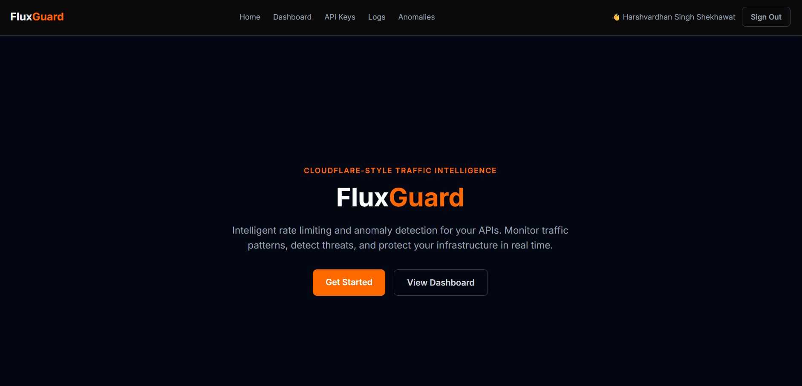
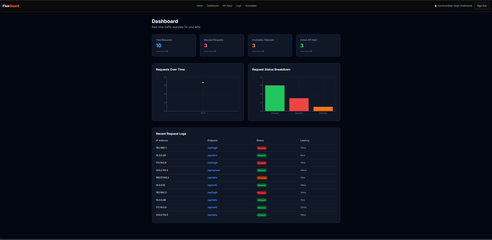
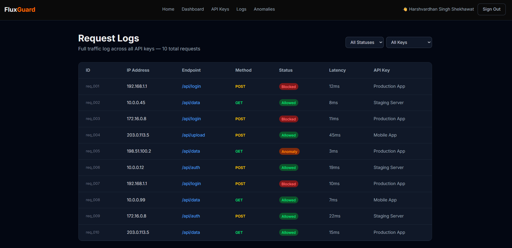
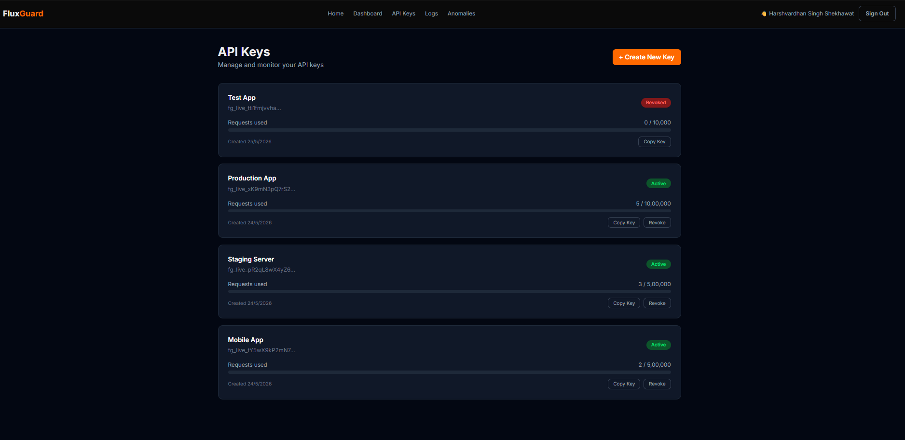
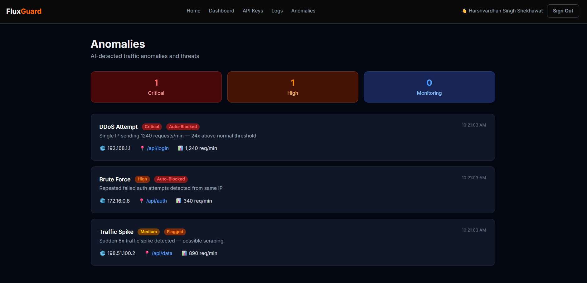

# FluxGuard 🛡️

**Intelligent Rate Limiting & Anomaly Detection Platform**

A production-grade, Cloudflare-inspired API security dashboard built with Next.js, PostgreSQL, and ML-based threat detection.

🔗 **Live Demo:** https://fluxguard-murex.vercel.app

---

## 🚀 Features

- **Smart Rate Limiting** — Token-bucket algorithm that tracks requests per IP, auto-blocks threats, and returns HTTP 429 on limit breach
- **ML Anomaly Detection** — Z-score statistical analysis identifies suspicious IPs and unusual traffic patterns automatically
- **Real-time Dashboard** — Live charts showing request volume over time and status breakdown (Allowed/Blocked/Anomaly)
- **API Key Management** — Create, copy, and revoke API keys with usage tracking and progress bars
- **Request Logs** — Full traffic log with filterable status and API key columns
- **Authentication** — Secure Sign Up / Sign In with NextAuth.js and bcrypt password hashing
- **Protected Routes** — Middleware-based route protection redirects unauthenticated users

---

## 🏗️ Tech Stack

| Layer | Technology |
|-------|-----------|
| Frontend | Next.js 14, React, Tailwind CSS |
| Backend | Next.js API Routes, Node.js |
| Database | PostgreSQL (Railway) |
| ORM | Prisma |
| Auth | NextAuth.js + bcryptjs |
| Charts | Recharts |
| Deployment | Vercel (frontend) + Railway (database) |

---

## 🧠 Technical Highlights

### Token-Bucket Rate Limiter
Implemented a sliding-window rate limiter using an in-memory Map data structure. Each IP gets a time-bounded request quota — exceeding it returns HTTP 429. Directly maps to OS process scheduling concepts from coursework.

### Z-Score Anomaly Detection
Statistical ML model that calculates mean and standard deviation of request patterns. IPs with Z-score > 2 are flagged as anomalies and automatically logged to the database — no manual rules needed.

### Cloudflare-Inspired Architecture
- API gateway middleware pattern
- Per-IP rate limiting (mirrors Cloudflare Rate Limiting product)
- Anomaly auto-detection (mirrors Cloudflare Bot Management)
- Request log analytics (mirrors Cloudflare Analytics dashboard)

---

## 🗄️ Database Schema
User          — Authentication (id, name, email, password)
ApiKey        — API key management (id, name, key, tier, limit, isActive)
RequestLog    — Traffic logs (id, ip, endpoint, method, status, latency, apiKeyId)
Anomaly       — Detected threats (id, type, ip, severity, status, description)

---

## 🚦 API Endpoints

| Method | Endpoint | Description |
|--------|----------|-------------|
| GET | /api/keys | List all API keys |
| POST | /api/keys | Create new API key |
| DELETE | /api/keys/[id] | Revoke an API key |
| GET | /api/logs | Get request logs |
| POST | /api/logs | Log a new request |
| GET | /api/anomalies | Get detected anomalies |
| POST | /api/ratelimit | Check rate limit for an IP |
| GET | /api/detect | Run ML anomaly detection |

---

## 🛠️ Running Locally

```bash
# Clone the repository
git clone https://github.com/Harshvardhan-Singh-Shekhawat/fluxguard.git
cd fluxguard

# Install dependencies
npm install

# Set up environment variables
# Create .env file with:
# DATABASE_URL="your-postgresql-url"
# NEXTAUTH_SECRET="your-secret"
# NEXTAUTH_URL="http://localhost:3000"

# Push database schema
npx prisma db push

# Seed the database
npx prisma db seed

# Run development server
npm run dev
```

---

## 📸 Screenshots

### Landing Page


### Dashboard


### Logs


### API Keys


### Anomalies


---

## 👨‍💻 Built By

**Harshvardhan Singh Shekhawat**
B.Tech Computer Science | Internship @ Cloudflare-stack Networking Company

---

## 📚 Academic Concepts Applied

- **DSA** — Token bucket using Map data structure, O(1) IP lookup
- **OS** — Rate limiting as process scheduling, bounded request queues
- **ML** — Z-score statistical anomaly detection
- **DBMS** — Relational schema design, foreign keys, indexed queries
- **Networks** — API gateway pattern, HTTP status codes, request lifecycle